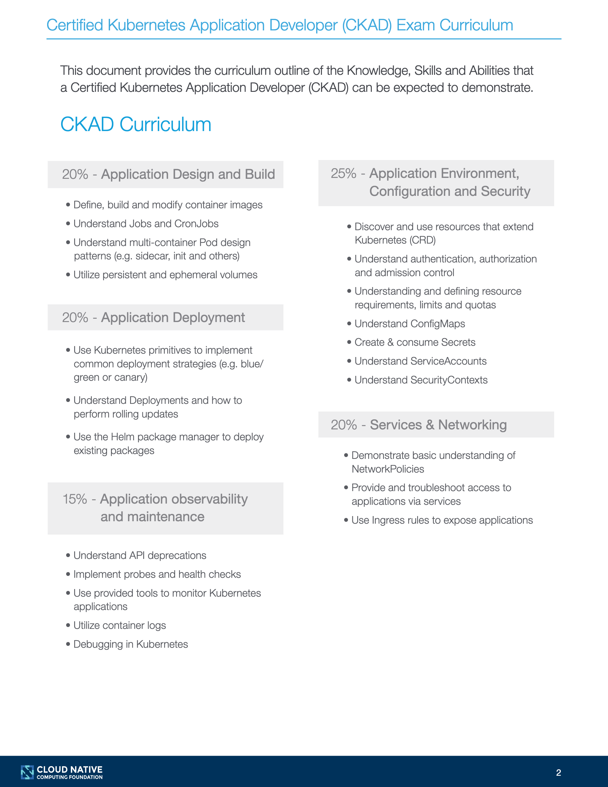

# CKAD-guide-2023

Welcome to CKAD guide, the purpose of this content is to share and give some tricks for preparing  in **Certified Kubernetes Application Developer (CKAD) Certification**

## Index

- 1. [How to start ?](#how-to-start)
- 2. [Installing K8 for windows, linux or MAC](#installing-k8)
- 3. Configurations
- 4. Trips before hitting the certification exam


### How to Start
* Before you start doing some practices and start with the course you should read the Exam curriculum
  #



#### Topics are divided by this sections inside the course:
- **1.Kubernetes Architecture** (Ideal for understanding the basics as Services, Pods, Worker Nodes, Control Plane Nodes)
#
- **2.Build** (Essential docker knowledge, Readiness, liveness  and startupProbe, Deployment and multi-container pods, Helm introduction and testing)
#
- **3.Design** (Labeling, Multi-container pods, Resource usage and managing, Jobs & Cronjobs)
#
- **4.Deployment Configuration** (Volumes,Persistent Volume and PVClaims, Secrets, Configmaps, scalling and rolling updates, rollbacks)
#
- **5.Security** (Admission Controllers, Security Context, Network security policies, Secrets, RBAC-Role Based Access Control and Authentication)
#
- **6.Exposing Applications**(Services, Ingress and Service Mesh)
#
- **7.Application trouble shooting** (Logging, Monitoring, Agent Logs, External tools, Security)
#

### Installing K8
 There are plenty ways to install k8 on any device, is important to know that if you dont have a license of Docker for Desktop can use this alternatives:

  - [Podman](https://podman.io/getting-started/installation)
  - [Rancher](https://rancherdesktop.io/)

#### Linux:
 You can install k8 easily using next options:
 - [k3s](https://k3s.io/)
 - [microk8s](https://microk8s.io/)


### Configurations
The course will provide you 2 materials 1 the files of some excercises and a **Bash script** that installs containerd, updates os repositories and runs a k8 cluster on your machine with all the initial configuration setted,
**P.D:** i coulnd't use this one because my machine was using an arm64 and the repositories and apps that are trying to call doesn't work for my OS.

I recommend you to **DON't use the script unless you have a supported CPU arch,amd64** at least for 2023, the script is not optimized for other arch


### Tips before hitting the exam
- Don't start the certification exam without taking the simulator, the exam actually comes with a free try of the simulator, you can check it ou here: [CKAD Simulator](https://killer.sh/faq)
  #
- The course will recommend you to install podman instead of docker, if you already have docker runtime in your machine you don't really need to install podman
 
- Adding a worker node: Docker for desktop runs in a single node so the only option would be to install `kubeadmn` and create another worker node
- **for k3s** `sudo k3s kubectl get node <node-name> -o jsonpath='{.spec.taints[0].value}'` replace the node-name with the name you want for the node, and finally paste the output and login to the worker node

  
- For the local repository problem (the practice tells you to use http instead of https for practicity):

#### Docker desktop
 simply go to "**Preferences > DockerEngine**" in Docker-for-desktop and add

```json {
  "registry-mirrors": [
    "<your_registry_ip>"
  ]
```
### k3s and rancher
`sudo vim /etc/rancher/k3s/registries.yaml` and
add following:
```yaml
mirrors:
  "https://<your_registry_ip>":
    endpoint:
      - "http://<your_registry_ip>"
```
